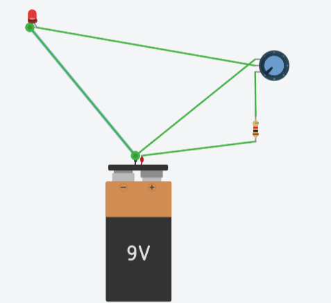
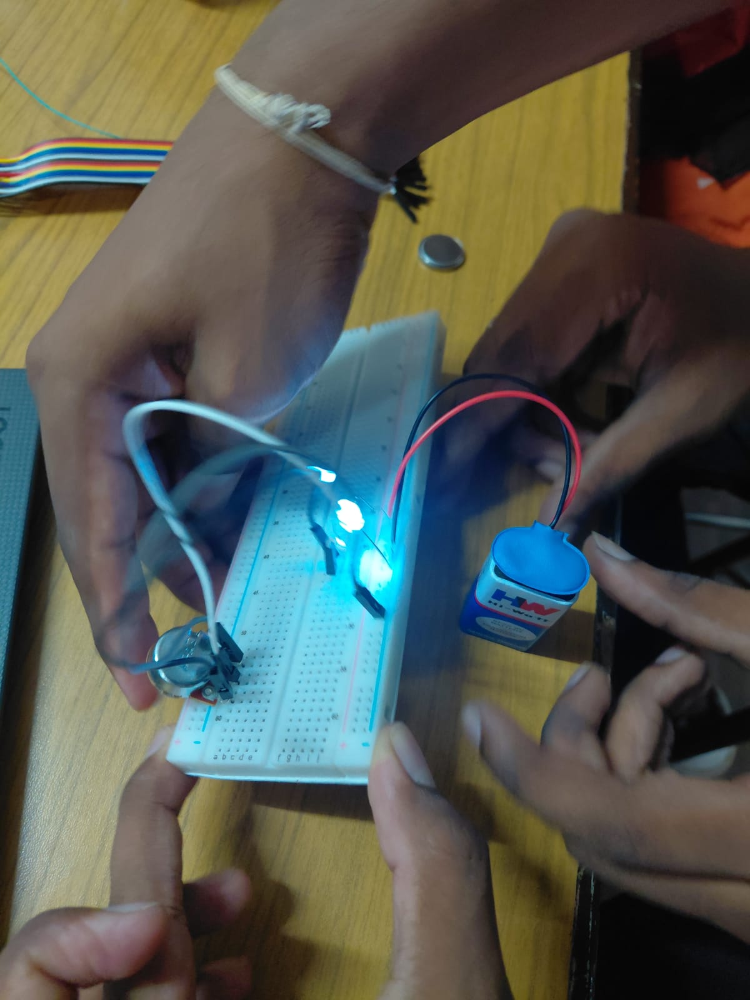

# **LED BRIGHTNESS CONTROLLER USING POTENTIOMETER**

## **1\. OBJECTIVE**

The purpose of this project is to vary the intensity of an LED by using a potentiometer. This project also helps to understand how a potentiometer can be used to control the voltage supplied to an LED.

## **2\. COMPONENTS REQUIRED**

The following components are needed to construct the circuit:

1. LED  
2. Potentiometer  
3. Breadboard  
4. Connecting wires  
5. Resistor  
6. 9V Battery

## **3\. PROCEDURE**

1. Place the potentiometer on the breadboard and connect its terminals to the 9V supply and ground.  
2. Take the centre terminal of the potentiometer and connect it to one end of the resistor.  
3. Connect the other end of the resistor to the positive terminal (anode) of the LED.  
4. Connect the negative terminal (cathode) of the LED to ground.  
5. Turn ON the 9V power supply.  
6. Rotate the potentiometer slowly and observe the change in LED brightness.

**Circuit Image:**

## **4\. WORKING**

The potentiometer acts as a variable voltage controller in this circuit. When the knob is rotated, the resistance and output voltage from the potentiometer change. This causes the current flowing through the LED to vary.

When the output voltage is increased, more current flows through the LED and its brightness increases. When the potentiometer is rotated in the opposite direction, the voltage and current supplied to the LED decrease, causing the LED to become dimmer.

Thus, the brightness of the LED can be controlled manually by adjusting the potentiometer.

## **5\. RESULT**

The LED brightness was successfully controlled using a potentiometer. The project demonstrates the practical use of a variable resistor for controlling the intensity of an LED.

